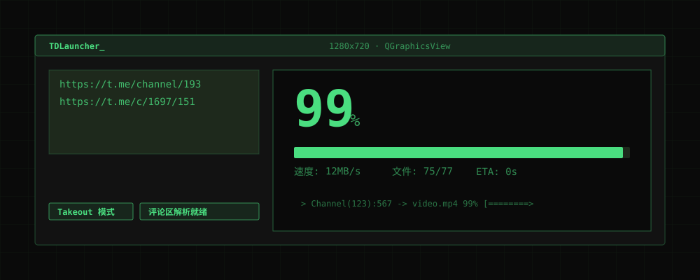

<div align="center">
  <picture>
    
  </picture>

  <h1>TDLauncher</h1>
  <p><b>为 Telegram 高速下载引擎 <a href="https://github.com/iyear/tdl">tdl</a> 打造的终端风图形控制台</b></p>

  <p>
    
    
    
    
  </p>
</div>

---

**[English](#english)** · [简体中文](#中文)

---

<a id="english"></a>

## Beyond the Command Line

[tdl](https://github.com/iyear/tdl) is arguably the most powerful Telegram downloader available, capable of saturating your bandwidth and exporting restricted content. However, managing command-line flags, bypassing API flood limits, and tracking the progress of 100+ files can be overwhelming.

**TDLauncher** bridges the gap between hacker-level efficiency and desktop usability.

* **The Takeout Arsenal:** A dedicated switch for Telegram's "Takeout" mode, bypassing severe rate limits (`Flood wait`) when archiving massive channels.
* **Intelligent Thread Harvesting:** Paste a single post link, and the engine automatically exports and downloads the entire attached comment thread via JSON parsing.
* **Safe Sequential Dispatch:** tdl uses an exclusive BoltDB lock. TDLauncher handles the queue safely, preventing database collision errors.
* **Real-time Phosphor Dashboard:** 33ms-tick progress parsing translates messy terminal stdout into a clean 16:9 cinematic terminal UI.

### Quick Start

**1. Install Dependencies**
Download the `tdl.exe` binary from the [tdl releases](https://github.com/iyear/tdl/releases) and place it in your system PATH, or use PowerShell:
```powershell
iwr -useb https://docs.iyear.me/tdl/install.ps1 | iex
tdl login -T qr
```

**2. Launch the Console**
```powershell
git clone https://github.com/comzxkd/TDLauncher.git
cd TDLauncher
pip install -r requirements.txt
python app\main.py
```

*For a zero-setup experience, download the pre-packaged portable `.exe` from the [Releases](https://github.com/comzxkd/TDLauncher/releases) page.*

### Engineering Boundaries

This project follows an strict "Aggregation" architecture. The UI is licensed under **MIT**, leaving you entirely free to modify the interface. It invokes the unmodified **AGPL-3.0** `tdl` engine as a detached asynchronous `QProcess`, ensuring complete compliance and separation of concerns. 

---

<a id="中文"></a>

## 终端之上的掌控感

[tdl](https://github.com/iyear/tdl) 是目前生态内最强悍的 Telegram 下载引擎，能跑满带宽并轻松跨越私有频道的阻碍。然而，对普通桌面用户而言，在黑框框里拼接长串参数、应对动辄几个小时的 `Flood wait` 限流惩罚、以及在滚屏的日志里寻找下载进度，始终是一种折磨。

**TDLauncher** 为此而生：它不仅是一套皮肤，而是一台解决痛点的调度台。

* **防封神器 Takeout**：一键开启数据导出特权通道。当你需要将整个频道的成百上千个媒体搬空时，彻底告别恼人的限流惩罚。
* **评论区自动捕获**：只需丢入主帖链接，系统会自动执行「导出讨论树 JSON → 解析总数 → 逐个媒体精确拉取」的三步流，大百分比进度严丝合缝。
* **队列安全互斥**：底层 tdl 的数据库带有强排他锁。我们将队列串行化并在底层阻断冲突，只把最平滑的任务切换展示给你。
* **磷光终端美学**：黑绿配色的 16:9 画动画等比缩放引擎，33ms 实时捕捉底层子进程的心跳日志，还原极客风格的下载律动。

### 部署指南

**1. 准备核心引擎**
你可以前往 [tdl releases](https://github.com/iyear/tdl/releases) 手动下载二进制文件，或者用一键脚本安装并扫码登录：
```powershell
iwr -useb https://docs.iyear.me/tdl/install.ps1 | iex
tdl login -T qr
```

**2. 点火启动**
```powershell
git clone https://github.com/comzxkd/TDLauncher.git
cd TDLauncher
pip install -r requirements.txt
python app\main.py
```
*如果你不想配置任何环境，请直接前往 [Releases](https://github.com/comzxkd/TDLauncher/releases) 下载包含了环境与引擎的即用版免安装压缩包。*

### 开源合规承诺

本项目采用纯净的进程外壳设计（QProcess）。外层 GUI 界面采用极度宽松的 **MIT** 协议，赋予你无限的魔改自由；同时我们在运行时以外部指令流拉起 **AGPL-3.0** 协议的底层引擎，遵守系统级调用的隔离边界。